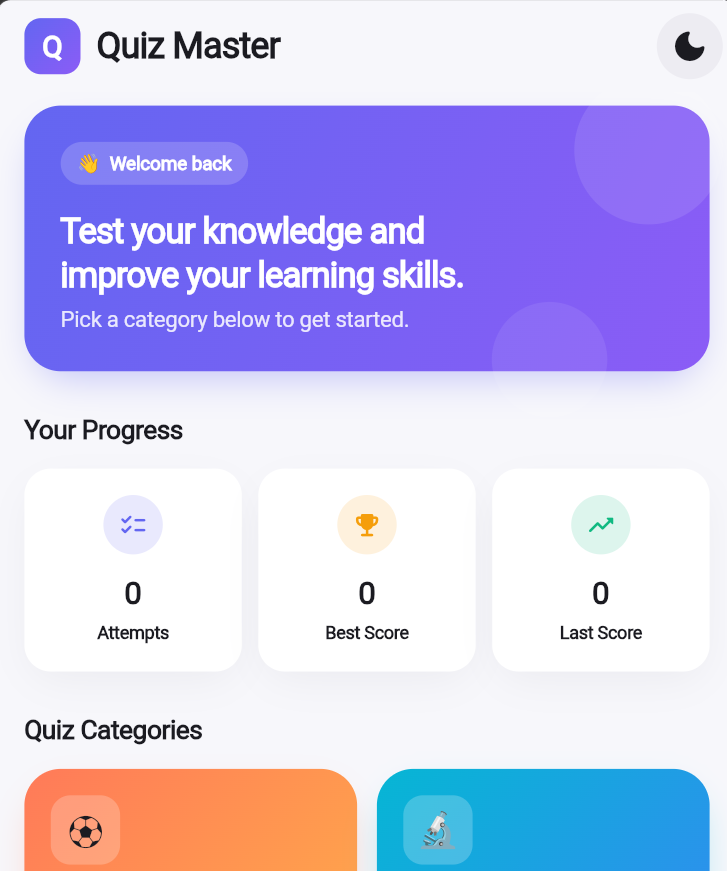
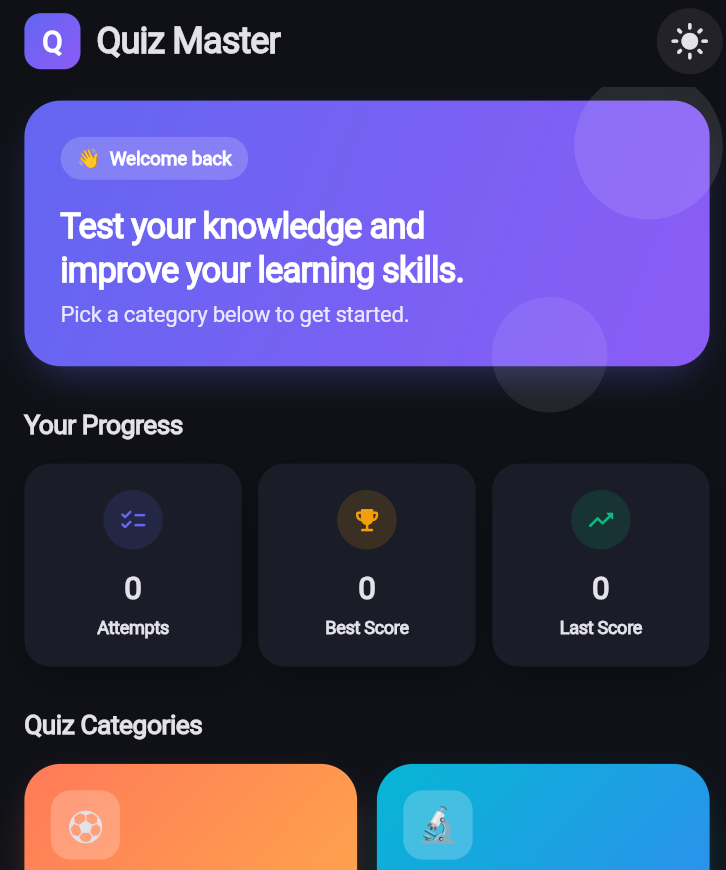
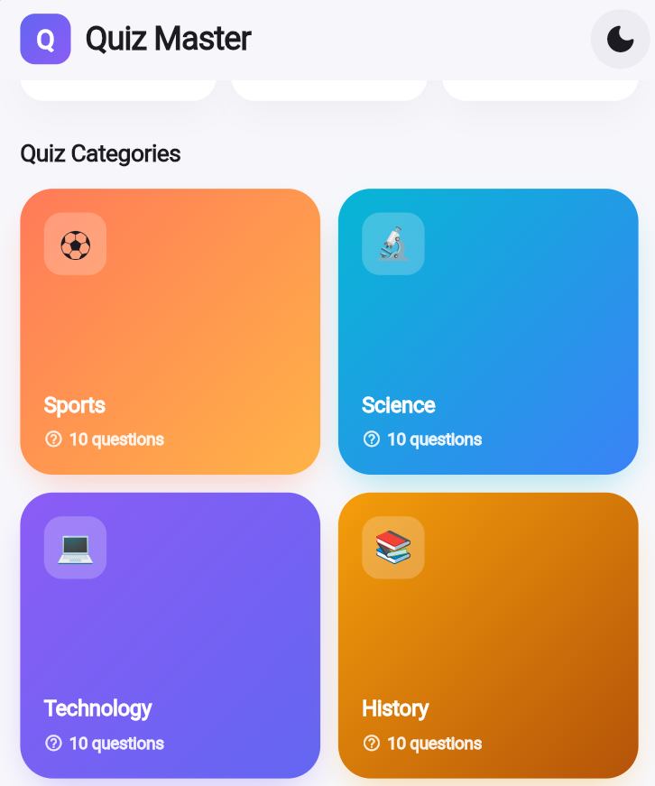
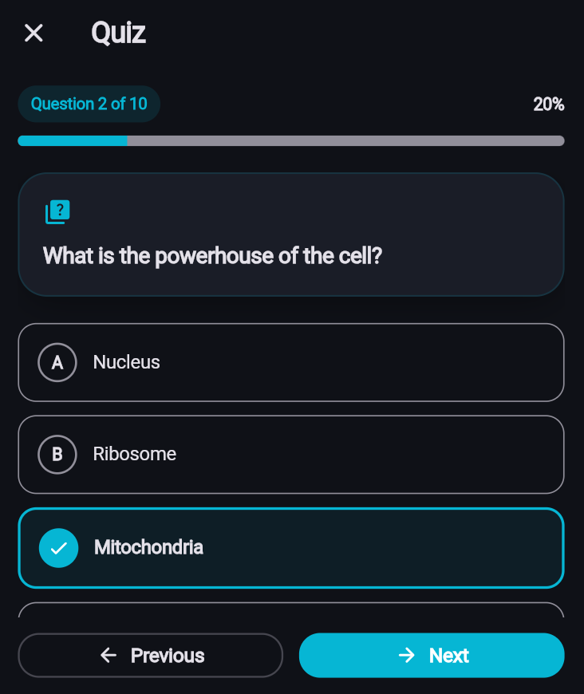
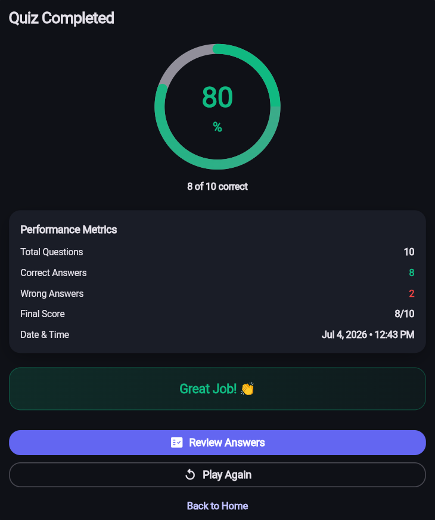
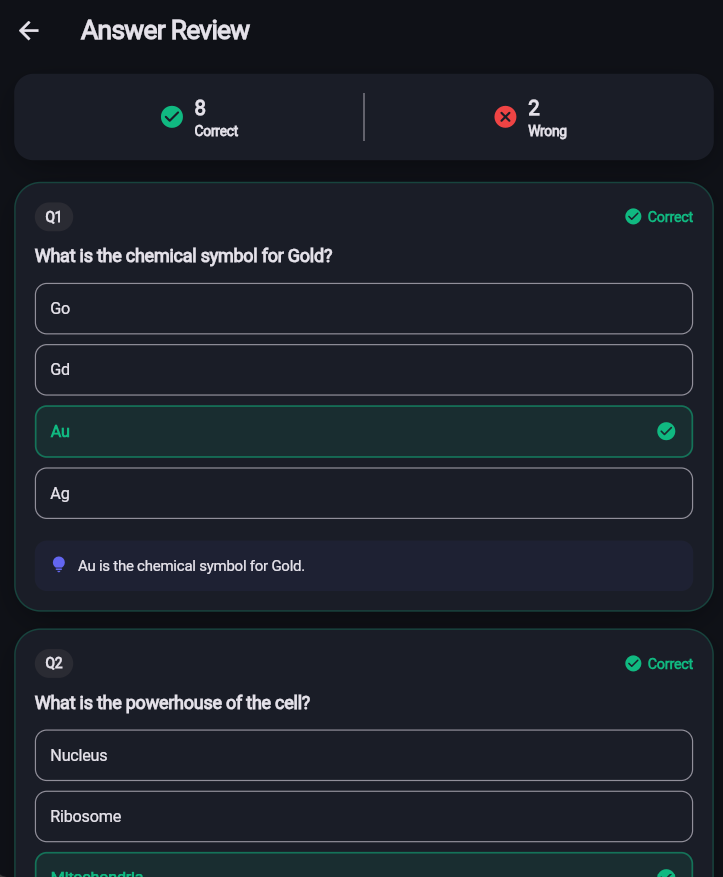

# 🧠 Quiz Master

A feature-rich, beautifully designed quiz application built with **Flutter**, showcasing real-world app development practices — state management, local persistence, declarative routing, and a clean, scalable architecture.

---

## 📱 About the Project

**Quiz Master** lets users test their knowledge across multiple categories, track their performance over time, and review their answers after every quiz — all without any backend or internet connection. Every piece of data (theme preference, quiz history, statistics) is stored locally on the device using `SharedPreferences`.

The project focuses on:

- Declarative routing with **GoRouter**
- Local data persistence with **SharedPreferences**
- State management using **Provider**
- Clean, modular architecture (UI / Models / Providers / Services)
- Polished, custom UI/UX design

---

## 📸 Screenshots

| Home (Light Mode) | Home (Dark Mode) |
|---|---|
|  |  |

| Categories | Quiz Screen | Result Screen | Review Screen |
|---|---|---|---|
|  |  |  |  |

---

## ✨ Features

### 🏠 Home Screen (Dashboard)
- Custom AppBar with app branding and a **Light/Dark theme toggle**
- Theme preference **persists** across app restarts
- Welcome banner with a friendly greeting
- **Live statistics**: Total Attempts, Highest Score, Last Score
- **5 quiz categories** (Sports, Science, Technology, History, General Knowledge), each with an icon, name, and question count
- **Quiz History** section showing the last 10 quiz results

### ❓ Quiz Screen
- Dynamic question flow with a live **question counter** (e.g., "Question 3 of 10")
- Animated **progress bar** that updates with every question
- Clean, readable question cards
- 4-option multiple choice questions with single-selection highlighting
- **Next** button stays disabled until an option is selected
- Last question automatically shows a **Submit** button
- Exit confirmation dialog to prevent accidental quiz loss

### 🏆 Result Screen
- Animated circular score ring showing final percentage
- Detailed performance metrics: Total Questions, Correct Answers, Wrong Answers, Final Score
- Performance grade feedback (e.g., "Excellent! 🎉", "Keep Practicing 💪")
- **Play Again** — instantly restarts a new quiz in the same category
- **Review Answers** — see every question with your answer vs. the correct one
- **Back to Home** — return to the dashboard

### 📊 Local Data Persistence
- All quiz results, statistics, and theme preference are stored locally using `SharedPreferences`
- No API calls — the app works entirely offline, as required by the assignment

---

## 🛠️ Tech Stack

| Category | Technology |
|---|---|
| Framework | Flutter (Dart) |
| State Management | [`provider`](https://pub.dev/packages/provider) |
| Routing | [`go_router`](https://pub.dev/packages/go_router) |
| Local Storage | [`shared_preferences`](https://pub.dev/packages/shared_preferences) |
| Unique IDs | [`uuid`](https://pub.dev/packages/uuid) |
| Date Formatting | [`intl`](https://pub.dev/packages/intl) |

---

## 📂 Project Structure

```
lib/
├── main.dart                     # App entry point & GoRouter configuration
├── models/
│   └── quiz_models.dart          # Category, Question, QuizSession, QuizResult, QuizStatistics
├── providers/
│   ├── theme_provider.dart       # Theme state + persistence
│   └── quiz_provider.dart        # Quiz state, categories, and business logic
├── services/
│   ├── local_storage_service.dart # SharedPreferences read/write logic
│   └── quiz_data_loader.dart     # Loads questions from the bundled JSON asset
├── screens/
│   ├── home_screen.dart          # Dashboard
│   ├── quiz_screen.dart          # Quiz-taking flow
│   ├── result_screen.dart        # Score summary
│   └── review_screen.dart        # Answer-by-answer review
├── widgets/
│   ├── fade_slide_in.dart        # Entry animation wrapper
│   ├── pressable_scale.dart      # Tap-scale animation
│   └── score_ring.dart           # Animated circular score indicator
└── theme/
    └── app_theme.dart            # Centralized colors, spacing, and light/dark themes

assets/
└── quiz_data.json                # Question bank (5 categories × 10 questions)
```

---

## 🚀 Getting Started

### Prerequisites
- [Flutter SDK](https://docs.flutter.dev/get-started/install) (3.0.0 or higher)
- Android Studio / VS Code with the Flutter & Dart plugins
- A connected device, emulator, or a web browser (e.g., Microsoft Edge/Chrome)

### Installation

1. **Clone the repository**
   ```bash
   git clone https://github.com/<your-username>/flutter_quiz_master_app.git
   cd flutter_quiz_master_app
   ```

2. **Install dependencies**
   ```bash
   flutter pub get
   ```

3. **Run the app**
   ```bash
   flutter run
   ```
   To run in a specific browser (e.g., Edge):
   ```bash
   flutter run -d edge
   ```

---

## 🎯 How It Works

1. Pick a category from the Home Screen.
2. Answer 10 multiple-choice questions one at a time.
3. Submit the quiz to see your score, breakdown, and performance grade.
4. Review each answer in detail, or play again instantly.
5. Your stats and history are automatically saved for next time.

---

## 📌 Notes

- The app works fully **offline** — no API or internet connection is required.
- All state (theme, scores, history) survives app restarts thanks to `SharedPreferences`.

---

## 👤 Author

**Fatema Tuz Zohora**
| Department of Computer Science and Engineering 


---

## 📄 License

This project is developed for educational purposes as part of a course assignment.
